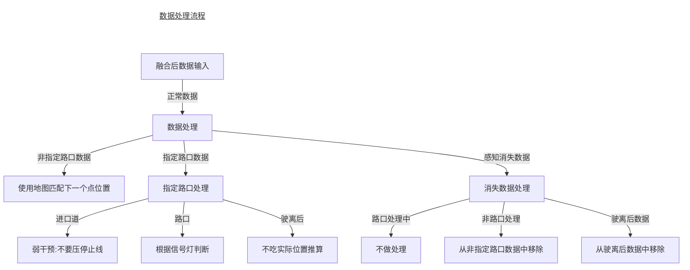

路口管理模块：路口中，路， lane信息
强干预， 路中央，使用信号灯及实际车速
弱干预， 进口道， 实际车速，定位，末端信号灯控制不越线

正常匹配：
进入路口
驶离路口

```mermaid
graph TB
title[<u>数据处理流程</u>]
title-->融合后数据输入
style title fill:#FFF,stroke:#FFF
linkStyle 0 stroke:#FFF,stroke-width:0;

融合后数据输入-->|正常数据|数据处理
数据处理-->|非指定路口数据|使用地图匹配下一个点位置
数据处理-->|指定路口数据|指定路口处理
数据处理-->|感知消失数据|消失数据处理
指定路口处理-->|进口道|弱干预处理[弱干预:不要压停止线]
指定路口处理-->|路口|根据信号灯判断
指定路口处理-->|驶离后|不吃实际位置推算
消失数据处理-->|路口处理中|不做处理
消失数据处理-->|非路口处理|从非指定路口数据中移除
消失数据处理-->|驶离后数据|从驶离后数据中移除

```

### 路口地图数据
* road信息生成
* 添加通过junction查找路信息的方法（是否需要生成junction信息）
* 信号灯数据接入
* road + laneseg + 信号灯