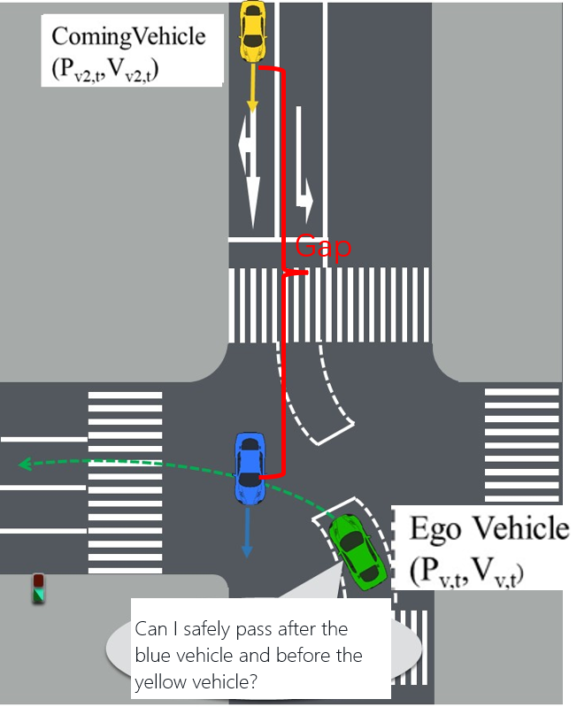
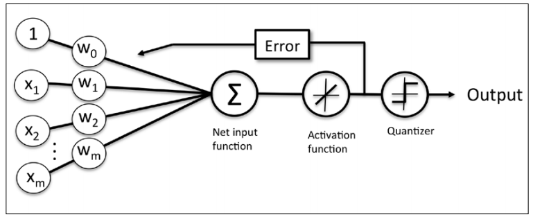
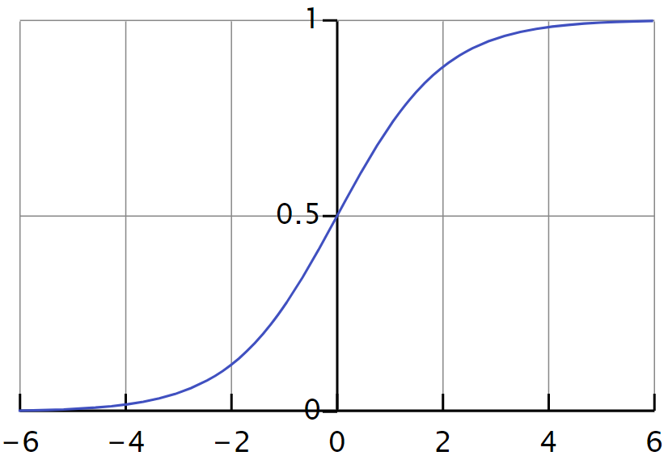

## Table of Contents

- [Table of Contents](#table-of-contents)
- [Introduction](#introduction)
- [Gap Scenario](#gap-scenario)
- [Gap Definition](#gap-definition)
- [MLE](#mle)
	- [1. Principal of MLE](#1-principal-of-mle)
	- [2. Applying MLE in Gap Acceptance](#2-applying-mle-in-gap-acceptance)
- [The log-likelihood](#the-log-likelihood)
- [Optimization](#optimization)
	- [Newton-Raphson method](#newton-raphson-method)
	- [Gradient descend method](#gradient-descend-method)

## Introduction

## Gap Scenario
Gap acceptance calculates the probability of passing before a vehicle. 

## Gap Definition 
Critical gap acceptance is a typical classification problem, which outputs 1 or 0, representing whether the vehicle will accept the gap or not. It can described with a logit model, to be more specific, a binomial logistic regression. A general logit model is defined as follows
$$
P\left( y_i=1|x_i \right) =S\left( \omega x_i \right) 
$$

$$
P\left( y_i=0|x_i \right) =1-S\left( \omega x_i \right) 
$$

Where $S\left( t \right)$ is Sigmoid function
$$
S\left( t \right) =\frac{1}{1+\exp \left( -t \right)}
$$

From the view point of AI, the logistic regression can be regarded as a simple network

The function takes in the linear combination of parameters and input date to generate a probability. Therefore, the result P is between 0 and 1, and as shown as follows

In the case of gap acceptance, we will consider the factors of vehicle position and vehicle speed.
$$
x=\left[ 1,D_{v2},V_{v2},D_{v1},V_{v1} \right] 
$$
Where
1 constant item
$$
D_{v2}
$$

## MLE
### 1. Principal of MLE
As long as gap acceptance is a logit model, MLE is a widely used method to estimate the parameters. 
We can refer to the psu manuscript of MLE for more details
https://online.stat.psu.edu/stat415/lesson/1/1.2 and https://www.statlect.com/fundamentals-of-statistics/logistic-classification-model \
Here we give a simple derivation of the problem.

Likelihood means the probability of an observation to happen, given the parameters. The ##likelihood of an observation 
$
\left( y_i,x_i \right) 
$
can be written as 
$$
L\left( \theta ;y_i,x_i \right) =\prod_{j=1}^J{\left[ f_j\left( x_i;\theta \right) \right] ^{y_{ij}}}
$$

For example, in the binomial case, when there are two classes (J=2) and the output variable belongs to the second class, we have that the realization of the Multinoulli random vector is
$$
y_i=\left[ \begin{matrix}
	0&		1\\
\end{matrix} \right] 
$$

The two components of the vector are
$$
y_{i1}=0
\\
y_{i2}=1
$$

and the likelihood is

$$
L\left( \theta ;y_i,x_i \right) =\prod_{j=1}^J{\left[ f_j\left( x_i;\theta \right) \right] ^{y_{ij}}}
\\
=\left[ f_1\left( x_i;\theta \right) \right] ^{y_{i1}}\cdot \left[ f_2\left( x_i;\theta \right) \right] ^{y_{i2}}
\\
=\left[ f_1\left( x_i;\theta \right) \right] ^0\cdot \left[ f_2\left( x_i;\theta \right) \right] ^1
\\
=1\cdot f_2\left( x_i;\theta \right) 
\\
=f_2\left( x_i;\theta \right) 
$$

Denote the 
$
N\times 1
$
vector of all outputs by y and the 
$
N\times K
$
matrix of all inputs by x. If we assume that the observations 
$
\left( y_i,x_i \right) 
$
in the sample are IID, then the likelihood of the entire sample is equal to the product of the likelihoods of the signle observations
$$
L\left( \theta ;y,x \right) =\prod_{i=1}^N{\prod_{j=1}^J{\left[ f_j\left( x_i;\theta \right) \right] ^{y_{ij}}}}
$$

For the purpose of simplification, we take the log-likelihood, which is
$$
l\left( \theta ;y,x \right) =\sum_{i=1}^N{\sum_{j=1}^J{\ln \left( f_j\left( x_i;\theta \right) \right)}}y_{ij}
$$
The maximum likelihood estimator 
$
\hat{\theta}
$
of the parameter 
$
\theta 
$
solves
$$
\hat{\theta}=arg\underset{\theta}{\max}\,\,l\left( \theta ;y,x \right) 
$$
To get the parameters that maximizes the log-likelihood, we derive the equation
$$
\nabla _{\theta}l\left( \theta ;y,x \right) =\nabla _{\theta}\left( \sum_{i=1}^N{\sum_{j=1}^J{\ln \left( f_j\left( x_i;\theta \right) \right)}}y_{ij} \right) 
\\
=\sum_{i=1}^N{\sum_{j=1}^J{\frac{y_{ij}}{f_j\left( x_i;\theta \right)}\nabla _{\theta}}}f_j\left( x_i;\theta \right) 
$$

Usually, there is no analytical solution for the estimation of parameters of logit functions. Therefore, we use numerical method as Newton-Raphson to solve it recursively.

### 2. Applying MLE in Gap Acceptance
Applying MLE includes the following steps
1. Define Likelihood
2. Define log-likelihood
3. Derive log-likelihood

The likelihood \
The likelihood of an observation 
$
\left( y_i,x_i \right) 
$
can be written as 
$$
L\left( \beta ;y_i,x_i \right) =\left[ S\left( x_i\beta \right) \right] ^{y_i}\left[ 1-S\left( x_i\beta \right) \right] ^{1-y_i}
$$
Denote the 
$
N\times 1
$
vector of all outputs by y and the 
$
N\times K
$
matrix of all inputs by x.
Since the observations are IID, then the likelihood of the entire sample is equal to the product of the likelihoods of the single observations:
$$
L\left( \beta ;y,x \right) =\prod_{i=1}^N{\left[ S\left( x_i\beta \right) \right] ^{y_i}\left[ 1-S\left( x_i\beta \right) \right] ^{1-y_i}}
$$

## The log-likelihood
The log-likelihood of the logistic model is
$$
l\left( \beta ;y,x \right) =\sum_{i=1}^N{\left[ -\ln \left( 1+\exp \left( x_i\beta \right) \right) +y_ix_i\beta \right]}
$$

The score \
The score vector, that is the vector of first derivatives of the log-likelihood with respect to the parameter 
$
\beta
$
, is
$$
\nabla _{\beta}l\left( \beta ;y,X \right) =\sum_i^N{\left[ y_i-S\left( x_i\beta \right) \right] x_i}
$$

The Hessian \
The Hessian, that is the matrix of second derivatives, is
$$
\nabla _{\beta \beta}l\left( \beta ;y,X \right) =-\sum_{i=1}^N{x_{i}^{T}x_iS\left( x_i\beta \right) \left[ 1-S\left( x_i\beta \right) \right]}
$$

The first-order condition \
When the maximization problem has a solution, at maximum the score vecotr satisfies the first order condition
$$
\nabla _{\beta}l\left( \beta ;y,X \right) =0
$$
that is
$$
\sum_i^N{\left[ y_i-S\left( x_i\beta \right) \right] x_i=0}
$$

## Optimization
The training of gap is actually the optimization problem to find the parameters which minimizes the loss function, which is the likelihood defined previously. There are two popular methods for optimization, which are Newton-Raphson method and Grandient Descent.

### Newton-Raphson method
The first order condition above has no explicit solution. Therefore, we implement Newton-Raphson method. We start from a guess of the solution
$
\hat{\beta}_0
$
(e.g.,)
$
\hat{\beta}_0=0
$
, and recursively update the guess with the equation

$$
\hat{\beta}_t=\hat{\beta}_{t-1}-\left[ \nabla _{\beta \beta}l\left( \hat{\beta}_{t-1};y,X \right) \right] ^{-1}\nabla _{\beta}l\left( \hat{\beta}_{t-1};y,X \right) 
$$

If you are not clear with Newton-Raphson method, please refer to https://web.mit.edu/10.001/Web/Course_Notes/NLAE/node6.html and https://sm1les.com/2019/03/01/gradient-descent-and-newton-method/

until numerical convergence.\
Denote by $
\hat{y}_t
$
the 
$
N\times 1
$
vector of conditional probabilities of the outputs computed by using as 
$
\hat{\beta}_t
$
parameter
$$
\hat{y}_t=\left[ \begin{array}{c}
	S\left( x_1\hat{\beta}_t \right)\\
	\vdots\\
	S\left( x_N\hat{\beta}_t \right)\\
\end{array} \right] 
$$

Denote by 
$
W_t
$
the 
$
N\times N
$
diagonal matrix such that the elements on its diagonal are
$
S\left( x_1\beta _t \right) \left[ 1-S\left( x_1\beta _t \right) \right] ,\cdots ,S\left( x_N\beta _t \right) \left[ 1-S\left( x_N\beta _t \right) \right] 
$
:

$$
W_t=\left[ \begin{matrix}
	S\left( x_1\beta _t \right) \left[ 1-S\left( x_1\beta _t \right) \right]&		0&		\cdots&		0\\
	0&		S\left( x_2\beta _t \right) \left[ 1-S\left( x_2\beta _t \right) \right]&		\cdots&		0\\
	\vdots&		\vdots&		\ddots&		0\\
	0&		0&		\cdots&		S\left( x_N\beta _t \right) \left[ 1-S\left( x_N\beta _t \right) \right]\\
\end{matrix} \right] 
$$

The 
$
N\times K
$
matrix of inputs
$$
X=\left[ \begin{array}{c}
	x_1\\
	\vdots\\
	x_N\\
\end{array} \right] 
$$
By using this notion, the score in Newton-Raphson recursive formula can be written as
$$
\nabla _{\beta}l\left( \hat{\beta}_{t-1};y,X \right) =X^T\left( y-\hat{y}_{t-1} \right) 
$$
and the Hessian as
$$
\nabla _{\beta \beta}l\left( \hat{\beta}_{t-1};y,X \right) =-X^TW_{t-1}X
$$

Therefore, the Newton-Raphson formula becomes
$$
\hat{\beta}_t=\hat{\beta}_{t-1}+\left( X^TW_{t-1}X \right) ^{-1}X^T\left( y-\hat{y}_{t-1} \right) 
$$

### Gradient descend method
Besides Newton-Raphson, Gradient descends can also be implemented to train the gap model. Actually descend is widely used in Machine Learning. The implementation of gradient descent is some how easier than the Newton-Raphson because we do not need to calculate the Hessian Matrix, and also avoid the inverse matrix of Hessian 
The target of Gradient Descent is recursively find the minimum value of
$
f\left( x \right)
$, which means to find 
$
f\left( x_t+\varDelta x \right) <f\left( x_t \right) 
$
.

The Taylor Series of 
$
f\left( x \right)
$ 
is
$$
f\left( x \right) =f\left( x_t \right) +f\prime\left( x_t \right) \left( x-x^t \right) +\frac{1}{2}f''\left( x_t \right) \left( x-x^t \right) ^2+\cdots 
$$
We tranche the taylor series until the first order item, and it becomes 
$$
f\left( x \right) =f\left( x_t \right) +f\prime\left( x_t \right) \left( x-x^t \right) 
$$

As 
$
x_{t+1}=x_t+\varDelta x
$, the previous equation can be written as 
$$
f\left( x_t+\varDelta x \right) =f\left( x_t \right) +f\prime\left( x_t \right) \cdot \varDelta x
$$

In order to make 
$
f\left( x_t+\varDelta x \right) <f\left( x_t \right) 
$, we need to make 
$
f\prime\left( x_t \right) \cdot \varDelta x<0
$. As far as 
$
f\prime\left( x_t \right) 
$
is fixed and 
$
\varDelta x
$
is changeable, we make 
$
\varDelta x=-\eta f\prime\left( x_t \right) 
$
, where 
$
\eta >0
$
, and 
$$
f\prime\left( x_t \right) \cdot \varDelta x=-\eta \left( f\prime\left( x_t \right) \right) ^2<0
$$
Therefore, when 
$
\varDelta x=-\eta f\prime\left( x_t \right) 
$
,
$
f\left( x_t+\varDelta x \right) <f\left( x_t \right) 
$

So in the case of Gap training, we can calculate the gradient descent as
$$
\hat{\beta}_t=\hat{\beta}_{t-1}-\eta \left( \nabla _{\beta}l\left( \hat{\beta}_{t-1};y,X \right) \right) =\hat{\beta}_{t-1}-\eta \left( X^T\left( y-\hat{y}_{t-1} \right) \right) 
$$

