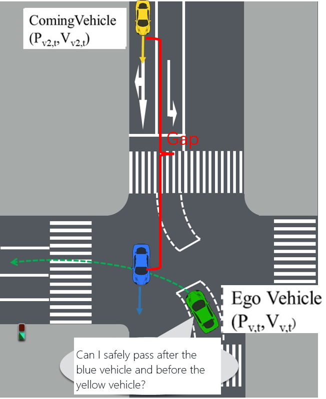
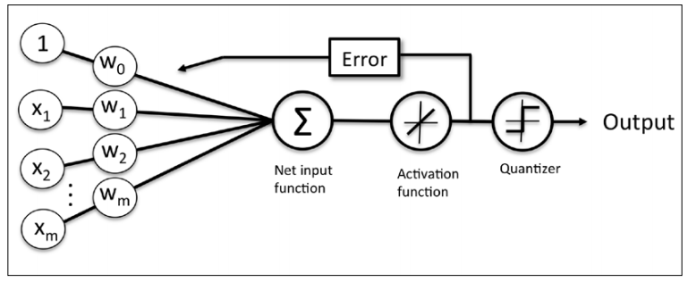
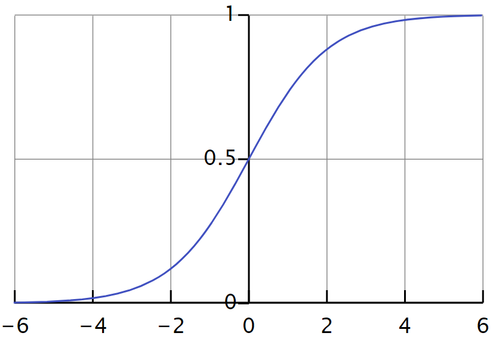

# Gap Introduction

## 1. Gap Scenario
Gap acceptance calculates the probability of passing before a vehicle. 

    
     
    

      Gap Scenario
  	

## 2. Gap Definition 
Critical gap acceptance is a typical classification problem, which outputs 1 or 0, representing whether the vehicle will accept the gap or not. It can described with a logit model, to be more specific, a binomial logistic regression. A general logit model is defined as follows
$$
P\left( y_i=1|x_i \right) =S\left( \omega x_i \right) 
$$

$$
P\left( y_i=0|x_i \right) =1-S\left( \omega x_i \right) 
$$

Where $S\left( t \right)$ is Sigmoid function
$$
S\left( t \right) =\frac{1}{1+\exp \left( -t \right)}
$$

From the view point of AI, the logistic regression can be regarded as a simple network

    
     
    

      Logit function sample
  	

The function takes in the linear combination of parameters and input date to generate a probability. Therefore, the result P is between 0 and 1, and as shown as follows

    
     
    

      Logit function sample
  	

In the case of gap acceptance, we will consider the factors of vehicle position and vehicle speed.
$$
x=\left[ 1,D_{v2},V_{v2},D_{v1},V_{v1} \right] 
$$

## 3. MLE
As long as gap acceptance is a logit model, MLE is a widely used method to estimate the parameters. 
We can refer to the psu manuscript of MLE for more details
https://online.stat.psu.edu/stat415/lesson/1/1.2 and https://www.statlect.com/fundamentals-of-statistics/logistic-classification-model \
Here we give a simple derivation of the problem.

Likelihood means the probability of an observation to happen, given the parameters. The likelihood of an observation 
$
\left( y_i,x_i \right) 
$
can be written as 
$$
L\left( \theta ;y_i,x_i \right) =\prod_{j=1}^J{\left[ f_j\left( x_i;\theta \right) \right] ^{y_{ij}}}
$$

For example, in the binomial case, when there are two classes (J=2) and the output variable belongs to the second class, we have that the realization of the Multinoulli random vector is
$$
y_i=\left[ \begin{matrix}
	0&		1\\
\end{matrix} \right] 
$$

The two components of the vector are
$$
y_{i1}=0
\\
y_{i2}=1
$$

and the likelihood is

$$
L\left( \theta ;y_i,x_i \right) =\prod_{j=1}^J{\left[ f_j\left( x_i;\theta \right) \right] ^{y_{ij}}}
\\
=\left[ f_1\left( x_i;\theta \right) \right] ^{y_{i1}}\cdot \left[ f_2\left( x_i;\theta \right) \right] ^{y_{i2}}
\\
=\left[ f_1\left( x_i;\theta \right) \right] ^0\cdot \left[ f_2\left( x_i;\theta \right) \right] ^1
\\
=1\cdot f_2\left( x_i;\theta \right) 
\\
=f_2\left( x_i;\theta \right) 
$$

Denote the vector of all outputs by y and the matrix of all inputs by x. If we assume that the observations in the sample are IID, then the likelihood

There is no analytical solution for the estimation of parameters of logit functions. 

