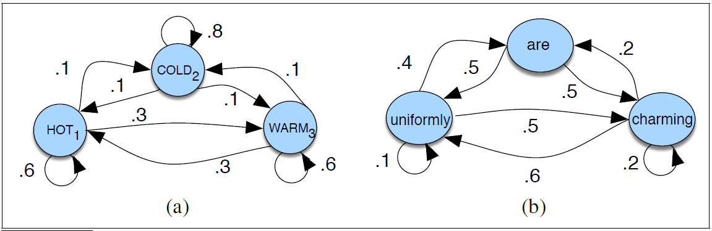

## Table of Contents

- [Table of Contents](#table-of-contents)
- [Introduction](#introduction)
- [Markov Chain](#markov-chain)
- [HMM Model](#hmm-model)
- [Foward-Backward](#foward-backward)
- [Forward](#forward)
- [Backward](#backward)
- [Baum-Welch algorithm](#baum-welch-algorithm)
- [Viterbi Alogorighm](#viterbi-alogorighm)
- [HMM Lane-Level Map Matching based on HMM](#hmm-lane-level-map-matching-based-on-hmm)

## Introduction
Hidden Malkov Model (HMM) is a model to extract truth from the observation. 

https://medium.com/analytics-vidhya/baum-welch-algorithm-for-training-a-hidden-markov-model-part-2-of-the-hmm-series-d0e393b4fb86

## Markov Chain
A Markov chain is a model that tells us something about the probability of sequences of random variables. The Markov chain makes a strong assumption that when we want to make a prediction of future, we only depend on the current, and all the past do not matter.

More formally, consider a sequence  of state variable $x_1$, $x_2$, $x_3$, Markov chain makes a strong Markov assumption
$$
P\left( x_i=a|x_1x_2\cdots x_{i-1} \right) =P\left( x_i=a|x_{i-1} \right) 
$$

## HMM Model
The Hidden Markov Model(HMM) allows us to talk about the hidden states and the observations. In addition to the first order markov assumption for the states, the HMM model introduce another assumption that the observation $y_i$ depends only on the state that produced the observation $x_i$ and not on any other states or any other observations
$$
P\left( y_i|x_1x_2\cdots x_Ty_1y_2\cdots y_T \right) =P\left( y_i|x_i \right) 
$$

The key factors of HMM are defined as follows

|  Symbols   | Meaning  |
|  ----  | ----  |
| X=$x_1$$x_2$...$x_N$  | a set of N states |
| A=$a_{11}$...$a_{ij}$...$a_{NN}$  | a transitional matrix, the probability of moving from state i to j |
| Y=$y_1$$y_2$...$y_T$  | a sequence of T observations |
| B=$b_i$($o_t$)  | emission probabilities, the probability of an observation $o_t$ generated by state i |
| $\pi$=$\pi_1$,$\pi_2$...$\pi_N$  | initial probability distribution over states |

A HMM should be characterized by three fundamental problems
|  Problem   | Meaning  |
|  ----  | ----  |
|Problem 1 (Likelihood):|Given A,B and Y, determine the likelihood P(Y\|A,B) |
|Problem 2 (Decoding):|Given A,B and Y, discover the best hidden state sequence X|
|Problem 3 (Learning):|Given X and Y, learn the HMM parameters A and B|

## Foward-Backward
We make the assumption that 

We want to determine the probability distribution of the state variable at any time k given the whole sequence of observed data. It can be understood mathematically
$$
P\left( X_k|Y_{0:T} \right) =\frac{P\left( X_k,Y_{0:T} \right)}{P\left( Y_{0:T} \right)}=\frac{P\left( X_k,Y_{0:k},Y_{k+1:T} \right)}{P\left( Y_{0:T} \right)}
\\
=\frac{P\left( X_k,Y_{0:k} \right) P\left( Y_{k+1:T}|X_k,Y_{0:k} \right)}{P\left( Y_{0:T} \right)}
$$
As long as the observations are independent of each other

$$
=\frac{P\left( X_k,Y_{0:k} \right) P\left( Y_{k+1:T}|X_k \right)}{P\left( Y_{0:T} \right)}
$$

We name the first term of numerator, which is a joint probability, 
$$
\alpha \left( X_k \right) =P\left( X_k,Y_{0:k} \right) 
$$

and the second term of numerator, the conditional probability

$$
\beta \left( X_k \right) =P\left( Y_{k+1:T}|X_k \right) 
$$

Therefore, the whole joint probability can be represented by a consise format

$$
P\left( X_k|Y_{0:T} \right) =\frac{\alpha \left( X_k \right) \beta \left( X_k \right)}{P\left( Y_{0:T} \right)}\propto \alpha \left( X_k \right) \beta \left( X_k \right) 
$$
The denominator term is a normalization constant and is usually dropped like this because it does not depend on the state, and therefore it is not important when comparing the probability of different states at any time k.

## Forward
We can use the marginalization of previous state to calculate the alpha function
$$
\alpha \left( X_k \right) =P\left( X_k,Y_{0:k} \right) =\sum_{X_{k-1}}{P\left( X_{k-1},X_k,Y_{0:k} \right)}
\\
=\sum_{X_{k-1}}{P\left( X_{k-1},Y_{0:k-1} \right) P\left( X_k|X_{k-1},Y_{0:k-1} \right) P\left( Y_k|X_k \right)}
$$

As stated before, state X does not depend on the observation Y, and we note that 
$$
\alpha \left( X_{k-1} \right) =P\left( X_{k-1},Y_{0:k-1} \right) 
$$

Then we can calculate the forward recursively

$$
\alpha \left( X_k \right) =\sum_{X_{k-1}}{\alpha \left( X_{k-1} \right) P\left( X_k|X_{k-1} \right) P\left( Y_k|X_k \right)}
$$
1. The alpha function is defined as the joint probability of the observed data up to time k and the state at time k
2. It is a recursive function because the alpha function appears in the first term of the right hand side (R.H.S.) of the equation, meaning that the previous alpha is reused in the calculation of the next. This is also why it is called the forward phase.
3. The second term of the R.H.S. is the state transition probability from A, while the last term is the emission probability from B.
4. The R.H.S. is summed over all possible states at time k -1.

We need the following starting alpha to begin the recursion.
$$
\alpha \left( X_0 \right) =P\left( X_0,Y_0 \right) =P\left( Y_0|X_0 \right) P\left( X_0 \right) 
$$

the starting alpha is the product of probabilities of the emission and the initial state

## Backward

$$
\beta \left( X_k \right) =P\left( Y_{k+1:T}|X_k \right) =\sum_{X_{k+1}}{\left( Y_{k+1:T},X_{k+1}|X_k \right)}
\\
=\sum_{X_{k+1}}{\left( Y_{k+2:T},X_{k+1},Y_{k+1}|X_k \right)}
\\
=\sum_{X_{k+1}}{\left( Y_{k+2:T}|Y_{k+1},X_{k+1},X_k \right) P\left( Y_{k+1}|X_{k+1},X_k \right)}P\left( X_{k+1}|X_k \right) 
$$

Therefore,
$$
\beta \left( X_k \right) =\sum_{X_{k+1}}{\left( Y_{k+2:T}|Y_{k+1} \right) P\left( Y_{k+1}|X_{k+1} \right)}P\left( X_{k+1}|X_k \right) 
\\
\sum_{X_{k+1}}{\beta \left( X_{k+1} \right) P\left( Y_{k+1}|X_{k+1} \right)}P\left( X_{k+1}|X_k \right) 
$$

Similar points could be made here:

1. The beta function is defined as the conditional probability of the observed data from time k+1 given the state at time k
2. It is a recursive function because the beta function appears in first term of the right hand side of the equation, meaning that the next beta is reused in the calculation of the current one. This is also why it is called a backward phase.
3. The second term of the R.H.S. is the state transition probability from A, while the last term is the emission probability from B.
4. The R.H.S. is summed over all possible states at time k +1.

Again, we need the ending beta to start the recursion.
$$
\beta \left( X_T \right) =1
$$

## Baum-Welch algorithm
Also known as the forward-backward algorithm, the Baum-Welch algorithm is a dynamic programming approach and a special case of the expectation-maximization algorithm (EM algorithm). Its purpose is to tune the parameters of the HMM, namely the state transition matrix A, the emission matrix B, and the initial state distribution π₀, such that the model is maximally like the observed data.

## Viterbi Alogorighm
Intuitively, with a given sequence of observation Y, we hope to know the best possible sequence of state X which is the most possible. Take the following image as an example

Formally speaking, we hope to maximise the joint probability of X and Y, which is propotional to maximise the conditional probability 
$$
X_{0:T}^{*}=\mathop {arg\max} \limits_{X_{0:T}}P\left( X_{0:T}|Y_{0:T} \right) 
$$

First, we make the following remark
$$
f\left( a \right) \geqslant 0,\forall a
\\
g\left( a,b \right) \geqslant 0,\forall b
\\
\max_{a,b} f\left( a \right) g\left( a,b \right) =\max_a \left\{ f\left( a \right) \max_b g\left( a,b \right) \right\} 
$$

The above equation will facilite our finding the maximum probability of a definitive r.v. X(k)
Instead of finding the argmax directly, we try first to investivagate the maximum value of the joint probability at time k 
$$
\mu \left( X_k \right) =\max_{X_{0:k-1}} P\left( X_{0:k},Y_{0:k} \right) 
\\
=\max_{X_{0:k-1}} P\left( X_{0:k-1},Y_{0:k-1},X_k,Y_k \right) 
\\
=\max_{X_{0:k-1}} P\left( X_{0:k-1},Y_{0:k-1} \right) P\left( X_k,Y_k|X_{0:k-1},Y_{0:k-1} \right) 
\\
=\max_{X_{0:k-1}} P\left( X_{0:k-1},Y_{0:k-1} \right) P\left( X_k|X_{0:k-1},Y_{0:k-1} \right) P\left( Y_k|X_k,X_{0:k-1},Y_{0:k-1} \right) 
$$

With the independency, X(t) only depends on X(t-1), and Y(t) depends on only X(t), so we can simplify the above equation as 
$$
\mu \left( X_k \right) =\max_{X_{0:k-1}} P\left( X_{0:k-1},Y_{0:k-1} \right) P\left( X_k|X_{k-1} \right) P\left( Y_k|X_k \right) 
$$

let
$$
a=X_{k-1}
\\
b=X_{0:k-2}
\\
f\left( a \right) =P\left( X_k|X_{k-1} \right) P\left( Y_k|X_k \right) 
\\
g\left( a,b \right) =P\left( X_{0:k-1},Y_{0:k-1} \right) 
$$

then
$$
\mu \left( X_k \right) =\max_{X_{k-1}} \left\{ P\left( X_k|X_{k-1} \right) P\left( Y_k|X_k \right) \max_{X_{0:k-2}} P\left( X_{0:k-1},Y_{0:k-1} \right) \right\} 
\\
=\max_{X_{k-1}} \mu \left( X_{k-1} \right) P\left( X_k|X_{k-1} \right) P\left( Y_k|X_k \right) 
$$

Again, the first term is a recursive item, the second one is the transitional probability, and the third one is the emission probability

$$
\mu \left( X_0 \right) =P\left( Y_0|X_0 \right) P\left( X_0 \right) 
\\
\mu \left( X_1 \right) =\max_{X_0} \mu \left( X_0 \right) P\left( X_1|X_0 \right) P\left( Y_1|X_1 \right) 
\\
\mu \left( X_2 \right) =\max_{X_1} \mu \left( X_1 \right) P\left( X_2|X_1 \right) P\left( Y_2|X_2 \right) 
\\
\mu \left( X_3 \right) =\max_{X_2} \mu \left( X_2 \right) P\left( X_3|X_2 \right) P\left( Y_3|X_3 \right) 
$$

1. The first formula is the starting mu function, and results in a probability distribution for seeing different initial state given the initial observed data. Here, we do not constrain ourselves to any of these initial state, but we determine that in the next formula.

2. The second formula picks up the best initial state that maximize the product of the terms in the right hand side, and leaving the first state as a free parameter to be determined in the third formula. Similarly, the third formula picks the best first state, then leave the second state for the fourth formula.

3. Let us visualize these repeated processes in a diagram called trellis. In the diagram, we could see how each state is being chosen based on the rule of maximizing the probability, and to keep the diagram small, I would take an assumption that there are only three possible states for us to choose from at each time step. The same idea applies to any number of states, of course.

The formal definition of the Viterbi recursion as follows,
1. Initialization

2. Recursion

3. Termination

## HMM Lane-Level Map Matching based on HMM
We realized the localization program based on paper
HMM Lane-Level Map Matching based on HMM
1. Hidden States \
   The states are assigned a geospatial ID, ex., x=1, x=2, x=3

2. Observations \
   In this work, we take the gps positioning result as observation. Therefore, the 
3. Translation Matrix

   
4. Observation Probability
$$
f_{Y_k}\left( y_k|x_k \right) =\frac{1}{\omega _{x_k}}\int\limits_{-0.5\omega _{x_k}}^{0.5\omega _{x_k}}{\frac{1}{\sqrt{2\pi \sigma _{GPS}^{2}}}e^{\frac{-\left( l-d \right) ^2}{2\sigma _{GPS}^{2}}}}dl
$$

5. 

