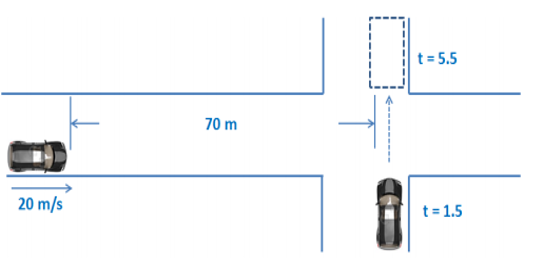

# TTC Introduction
TTC is a commonly used tool to estimate the traffic scenario
## 1. TTC Scenario

## 2. TTC Definition 

Basically, TTC is calculated vis the difference of distance and velocity. In the following equation 
$$
TTC=\frac{X_1\left( t \right) -X_2\left( t \right) -l_2}{V_1\left( t \right) -V_2\left( t \right)}
$$
$X_1\left( t \right)$ is the position of Vehicle 1 \
$X_2\left( t \right)$ is the position of Vehicle 2 \
$V_1\left( t \right)$ is the velocity of Vehicle 1 \
$V_2\left( t \right)$ is the velocity of Vehicle 2 \
asdfasdf